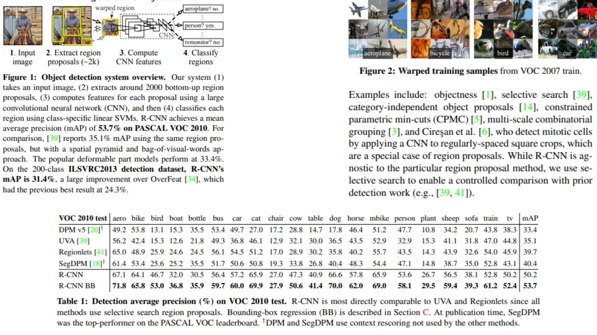
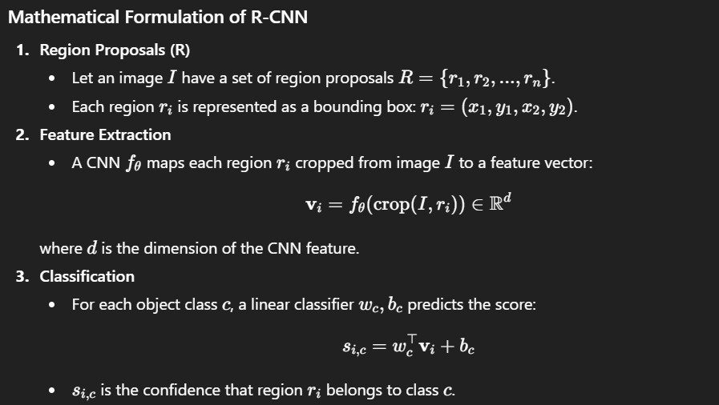

# 🐾 RCNN PyTorch Implementation

This repository contains a PyTorch implementation of **R-CNN**, following the original paper's **object detection pipeline using region proposals**. The model extracts features from image regions and classifies each region using a CNN backbone and a linear classifier.  

- Implemented **R-CNN pipeline** with **Selective Search** region proposals.  
- Architecture:  
**Image → Region Proposals → ROI Crops → CNN Feature Extraction → Linear Classifier**

> **Note on R-CNN:** The network is **agnostic to the proposal method**, but we use **Selective Search** for controlled comparison with prior detection work. ROI crops are resized and normalized before feature extraction.

**Paper reference:** [Rich feature hierarchies for accurate object detection and semantic segmentation](https://arxiv.org/abs/1311.2524) 🦉

---

## 🖼 Overview – R-CNN Pipeline

  
*Figure 1:* R-CNN object detection pipeline: input image → ~2000 selective search proposals → ROI crops → CNN feature extraction → class-specific SVM classification. Achieves 53.7% mAP on PASCAL VOC 2010, significantly outperforming prior approaches (e.g., spatial pyramid + bag-of-visual-words: 35.1%, DPM: 33.4%). On ILSVRC2013 (200 classes), R-CNN reaches 31.4% mAP vs 24.3% for OverFeat.
 
*Figure 2:* Warped training samples from VOC 2007 train

*Table 1:* Detection average precision (%) on VOC 2010 test. Compares R-CNN with UVA and Regionlets using selective search proposals. Notes top-performing SegDPM and context rescoring differences.


---

## 🧮 Key Mathematical Idea

  

This pipeline allows **accurate localization and classification** by focusing on candidate regions instead of full-image dense evaluation.

---

## 🏗️ Model Architecture

```bash
RCNN-Replication/
│
├── src/
│   ├── layers/
│   │   ├── conv_layer.py             # Basic conv + activation + pooling blocks
│   │   ├── roi_crop.py               # Crop feature maps based on region proposals
│   │   ├── linear_head.py            # Fully connected classifier (SVM/Softmax)
│   │
│   ├── modules/
│   │   ├── feature_extractor.py      # AlexNet-like backbone for ROI features
│   │   ├── proposal_generator.py     # Selective Search wrapper to generate ROIs
│   │   ├── proposal_processor.py     # Crop, resize, normalize each proposal
│   │
│   ├── model/
│   │   └── rcnn_model.py             # Complete R-CNN pipeline: proposals → crops → CNN → classifier
│   │
│   └── config.py                      # Input size, backbone layers, max proposals, etc.
│
├── images/
│   ├── figmix.jpg                    # Figures 1-2 + Table 1 from the paper
│   └── math.jpg                       # IoU formula + ROI feature classification overview
│
├── requirements.txt                   # minimal dependencies (torch, opencv, numpy)
└── README.md
```
---


## 🔗 Feedback

For questions or feedback, contact: [barkin.adiguzel@gmail.com](mailto:barkin.adiguzel@gmail.com)
